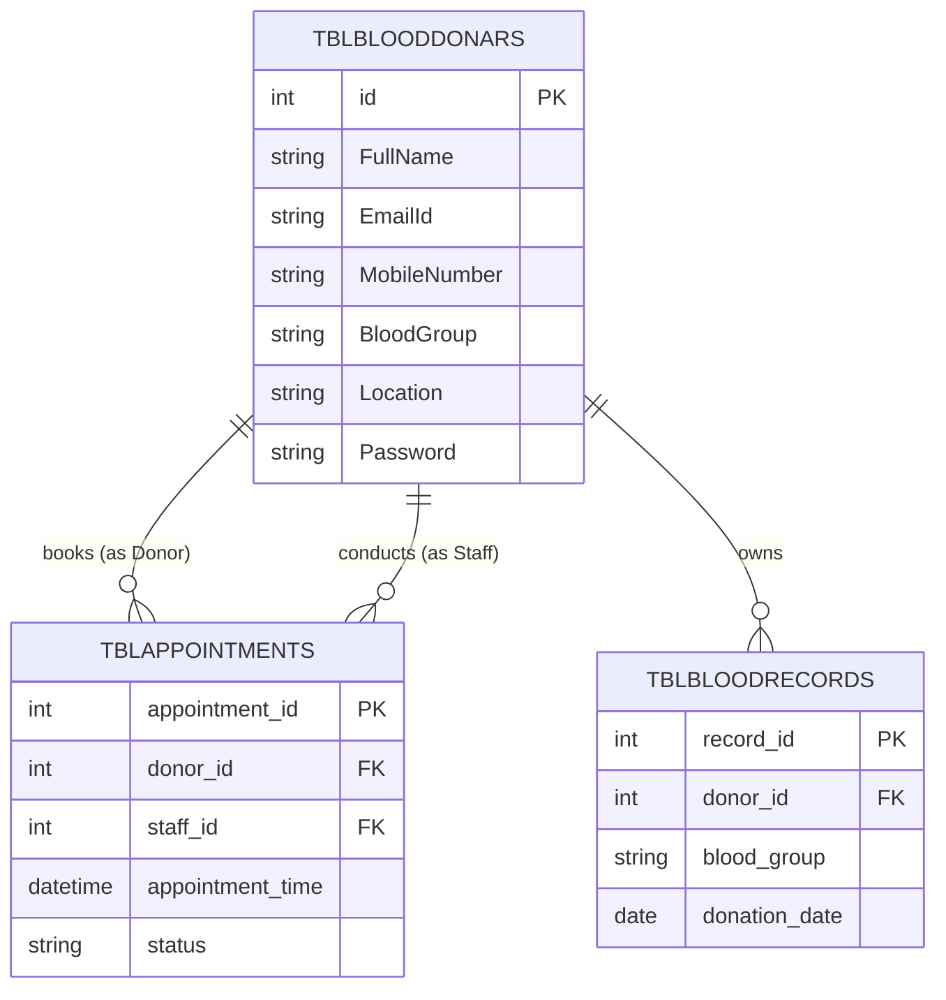

# Blood-Bank System SRS & ERD

## Normalized Database Schema (3NF)

Below is the Entity-Relationship Diagram for the Blood-Bank System, modeling the structure within the `bbdms` database per the Midterm Prototype requirements.

